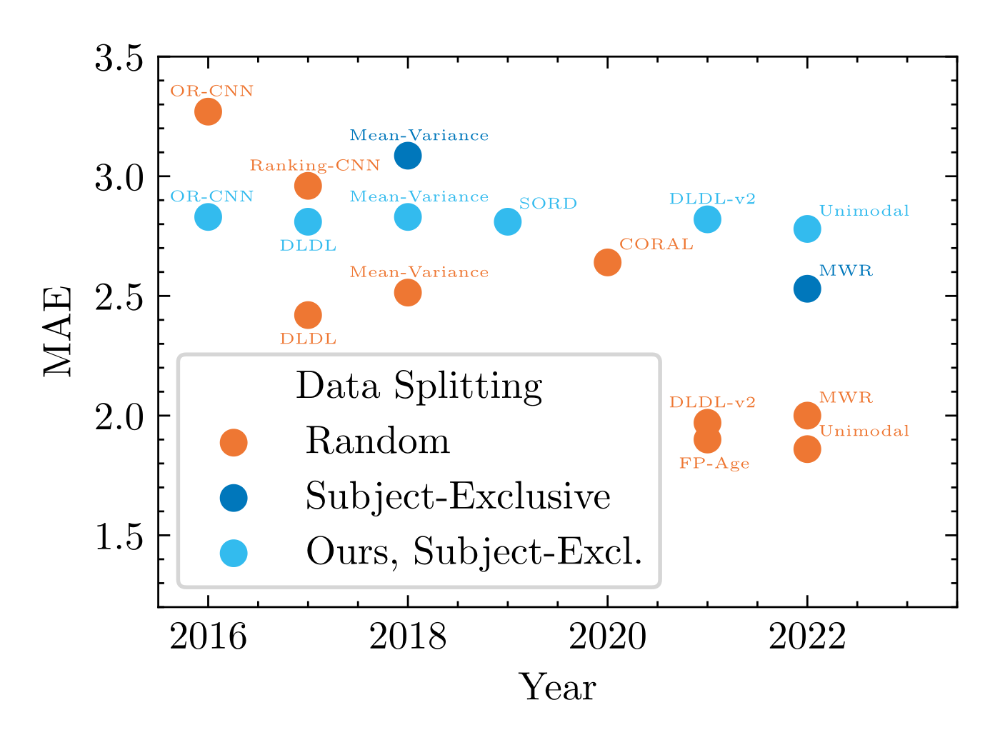

<!-- PROJECT LOGO -->
 

  

<h1 align="center">Facial Age Estimation Benchmark</h1>
  

    <a href="https://github.com/paplhjak/Facial-Age-Estimation-Benchmark/issues">Report Bug</a>
    ·
    <a href="https://github.com/paplhjak/Facial-Age-Estimation-Benchmark/issues">Request Feature</a>    
  

  

  arXiv: <a href="https://arxiv.org/abs/2307.04570">Unraveling the Age Estimation Puzzle: Comparative Analysis of Deep Learning Approaches for Facial Age Estimation</a>
  

<!-- ABOUT THE PROJECT -->

## About The Project

This repository serves as the official PyTorch codebase for the paper titled "Unraveling the Age Estimation Puzzle: Comparative Analysis of Deep Learning Approaches for Facial Age Estimation". You can find the paper on [arXiv](https://arxiv.org/abs/2307.04570) here.

Comparing different age estimation methods poses a challenge due to the unreliability of published results, stemming from inconsistencies in the benchmarking process. Previous studies have reported continuous performance improvements over the past decade using specialized methods; however, our findings challenge these claims.

  

    
We argue that, for age estimation tasks outside of the low-data regime, designing specialized methods is unnecessary, and the standard approach of utilizing cross-entropy loss is sufficient.

<!-- GETTING STARTED -->

## Getting Started

This README is designed to cater to three types of users:

- Users who only want to use the same data splits to ensure comparability with previous state-of-the-art methods, see ["Using the Data Splits"](doc/using_the_data_splits.md)
- Users who want to train the implemented age estimation models using this repository, see ["Using the Repository"](doc/using_the_repository.md)
- Users who want to implement their own methods, use this repository, and compare their results against the state-of-the-art, see ["Implementing New Methods"](doc/implementing_new_methods.md)

For each user type, a dedicated walk-through is provided. Click on the links above to access the relevant sections.

## Method Comparison

Welcome! Our goal is to provide an accurate, standardized, and unified evaluation platform for age estimation methods. Over the past decade, numerous works on age estimation have been published. However, due to inconsistencies in the evaluation setup across papers, it remains unclear which approaches truly deliver promising results.

Have you ever wondered where the reported improvements in age estimation come from when a new paper introduces a previously unseen Mean Absolute Error (MAE) on a dataset? Is it due to a better backbone model pretrained on more data? Or is it because of a superior image representation? It could also be the case that the method efficiently leverages the datasets. Unfortunately, with the currently published works, it is difficult to discern the true source of improvement.

To address this issue, we provide a unified training and evaluation setup, enabling us to benchmark a multitude of age estimation methods. By testing these methods in the same controlled setting, we have observed that many achieve comparable results.

Our aim is to foster collective efforts within the community to advance the state-of-the-art in age estimation and uncover which approaches are truly worth pursuing. By providing a common evaluation framework, we hope to encourage collaboration, facilitate knowledge sharing, and accelerate progress in this field.

We have compiled a comprehensive table showcasing the results of the benchmarked age estimation methods. We encourage anyone to contribute their own results to our benchmarking table. By sharing your findings, we can create a more diverse and comprehensive resource for the community. Simply submit your results as a pull request, including relevant details, and we will incorporate them into the table.

If you lack the necessary computational resources to evaluate your age estimation method, we are here to help. You can implement your method into our framework, and we will evaluate its performance using our standardized evaluation setup.

To contribute your results or request evaluation support, please contact us at [paplhjak@fel.cvut.cz]. We value your contributions.

Thank you for your interest and participation in our project.

| **Year** |                                                                                     **Method**                                                                                      | **AgeDB** | **AFAD** | **CACD2000** | **CLAP2016** | **MORPH** | **UTKFace** |
| :------: | :---------------------------------------------------------------------------------------------------------------------------------------------------------------------------------: | :-------: | :------: | :----------: | :----------: | :-------: | :---------: |
|    -     |                                                                               Baseline Cross-Entropy                                                                                |   5.81    |   3.14   |     3.96     |     4.49     |   2.81    |    4.38     |
|    -     |                                                                                 Baseline Regression                                                                                 |   6.23    |   3.17   |     4.06     |     4.65     |   2.83    |    4.72     |
|   2016   | [Ordinal regression with multiple output cnn for age estimation](https://www.cv-foundation.org/openaccess/content_cvpr_2016/papers/Niu_Ordinal_Regression_With_CVPR_2016_paper.pdf) |   5.78    |   3.16   |     4.01     |     4.13     |   2.83    |    4.40     |
|   2017   |                                              [Deep label distribution learning with label ambiguity](https://arxiv.org/abs/1611.01731)                                              |   5.80    |   3.14   |     3.96     |     4.18     |   2.81    |    4.39     |
|   2018   |           [Mean-variance loss for deep age estimation from a face](https://openaccess.thecvf.com/content_cvpr_2018/papers/Pan_Mean-Variance_Loss_for_CVPR_2018_paper.pdf)           |   5.85    |   3.16   |     4.07     |     4.28     |   2.83    |    4.42     |
|   2019   |              [Soft labels for ordinal regression](https://openaccess.thecvf.com/content_CVPR_2019/papers/Diaz_Soft_Labels_for_Ordinal_Regression_CVPR_2019_paper.pdf)               |   5.81    |   3.14   |     3.96     |     4.27     |   2.81    |    4.36     |
|   2021   |                                 [Age estimation using expectation of label distribution learning](https://www.ijcai.org/proceedings/2018/0099.pdf)                                  |   5.80    |   3.15   |     3.96     |     4.23     |   2.82    |    4.42     |
|   2022   |                          [Unimodal-concentrated loss: Fully adaptive label distribution learning for ordinal regression](https://arxiv.org/abs/2204.00309)                          |   5.90    |   3.20   |     4.10     |     4.17     |   2.78    |    4.47     |

<!-- CONTRIBUTING -->

## Contributing

Any contributions you make are **greatly appreciated**.

If you have a suggestion that would make this better, please fork the repo and create a pull request. You can also simply open an issue with the tag "enhancement".

1. Fork the Project
2. Create your Feature Branch (`git checkout -b feature/AmazingFeature`)
3. Commit your Changes (`git commit -m 'Add some AmazingFeature'`)
4. Push to the Branch (`git push origin feature/AmazingFeature`)
5. Open a Pull Request

Alternatively, contact us over email :cowboy_hat_face:

(<a href="#readme-top">back to top</a>)

<!-- CONTACT -->

## Contact

For questions/comments please email Jakub Paplham at paplhjak@fel.cvut.cz :slightly_smiling_face:

(<a href="#readme-top">back to top</a>)

<!-- MARKDOWN LINKS & IMAGES -->

[PyTorch.js]: https://img.shields.io/badge/PyTorch-%23EE4C2C.svg?style=for-the-badge&logo=PyTorch&logoColor=white
[PyTorch-url]: https://pytorch.org/
