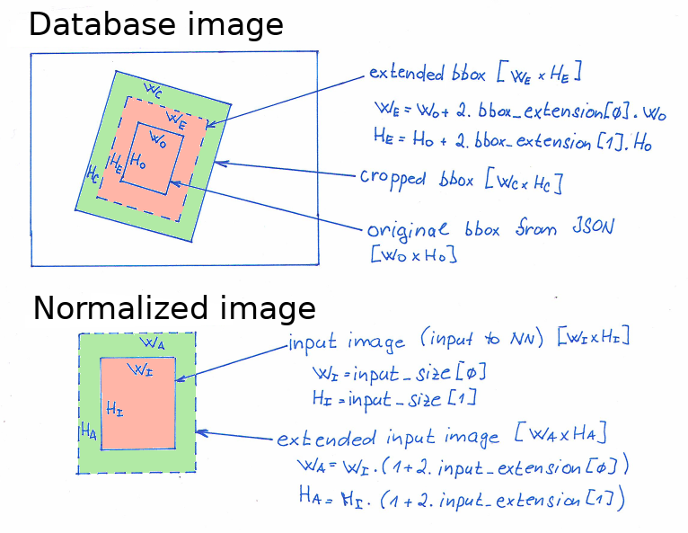

# Image Preprocessing and Augmentation

The image preprocessing and augmentation pipeline is an important step in preparing image data for training a machine learning model. In this project, the pipeline is implemented in two main modules, namely `prepare_data.py` and `train.py`, and utilizes the _Albumentations_ https://albumentations.ai/ library for data augmentation.

Image preprocessing and augmentations are specified in the `preprocess` section of the configuration file, e.g.,
```
preprocess:
    bbox_extension: [0.25,0.25]
    input_extension: [0.05,0.05]
    trn: {path: "lib/augmentation_configs/128x128/jitter+hflip.json"}
    val: {path: "lib/augmentation_configs/128x128/center_crop.json"}
```

## Image Cropping and Normalization

Image paths are loaded from a JSON database and are preprocessed using `prepare_data.py`. The images are cropped and normalized to a fixed size.

The cropping is performed around an _extended bounding box_, which is determined based on the _original bounding box_ defined in the JSON by items "bbox" (lower priority) or "bbox_aligned" (higher priority). The bounding box is extended by a factor specified as "bbox_extension". The extended bounding box is further extended by a factor specified as "input_extension". An illustration is provided in the image below.



The "bbox_extension" parameter is designed to enlarge the bounding boxes in order to ensure that they encapsulate the entire area of interest. In some cases, the provided bounding boxes may be too tight, for example, only encompassing the eyes and mouth but not the entire head. In such situations, "bbox_extension" can be used to expand the bounding box and ensure it covers the entirety of the region of interest.

On the other hand, the "input_extension" parameter is used exclusively for training purposes. During data augmentation, such as rotation or translation, the augmented crop may extend beyond the boundaries of the original crop. If the original bounding box is tight, it may require filling the area outside of it with a value, such as black. However, if the original bounding box is slightly larger, the augmented crop can still fit within it without requiring additional fill values.

## Data Augmentation

Data augmentation is a technique used to artificially increase the diversity of training data by applying various transformations to the images. This helps to reduce overfitting and improve the model's ability to generalize to new data. In this project, data augmentation is performed using the _Albumentations_ library, which provides a wide range of image augmentation techniques such as rotation, flipping, and much more.

The _Albumentations_ augmentation pipeline is defined by a separate JSON file, which specifies the transformations to be applied to the images. These JSON files are stored in the directory `lib/augmentation_configs`, and the experiment configuration YAML must specify the path to the desired augmentation JSON file for both training and validation data.

The first augmentation pipeline, `trn`, is applied during training. This pipeline should therefore contain all of the data augmentation to which the model prediction should be invariant, e.g., translation, rotation and noise.

The second pipeline, `val`, is applied at deployment time and during validation. It should therefore process the data deterministically.
